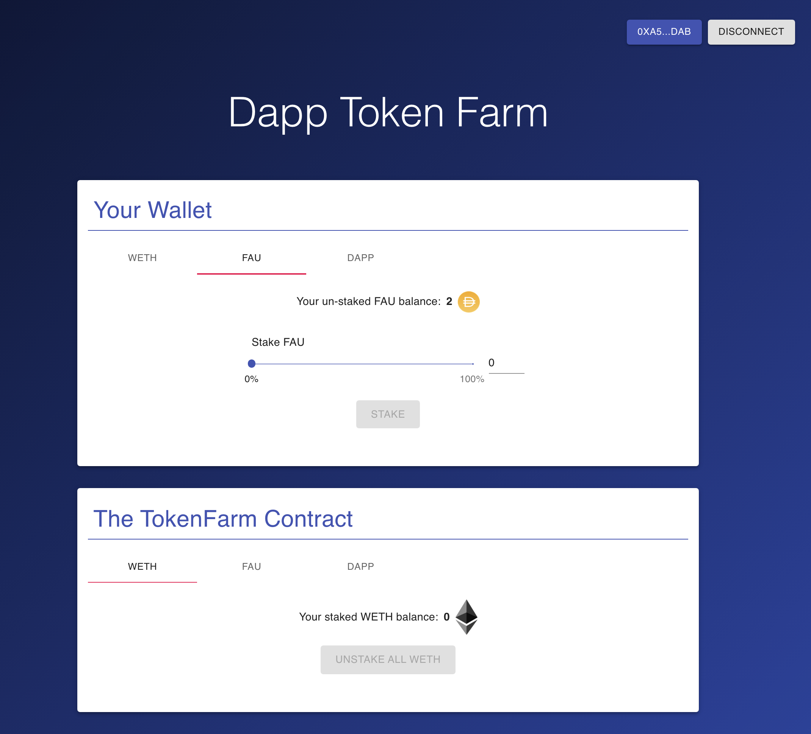

# Fullstack Defi Project: Token Bank

## Introduction

My first Fullstack Defi/Dapp Project.
Users can stake their ERC20 tokens on this platform, and then get rewarded by the reward token. (Similar to yieal farming or liquidity mining)



## Technology Used

- Smart Contract: Solidity, hardhat
- Frondend: React.js, ethers.js

## Development Progress

- [x] Ethereum Smart Contacts: Completed, and deployed on Rinkeby testnet.
- [ ] Frondend: TODO (I'm learning React.js)

### Deployed contract addresses on Rinkeby testnet

- RewardToken [0xe381ad995104C45B25D66CEA6645BaCA38A78A97](https://rinkeby.etherscan.io/address/0xe381ad995104C45B25D66CEA6645BaCA38A78A97)
- TokenBank v1.0 [0x62b5B6fbaF3b700c805a12460BceAA321Ba97e0B](https://rinkeby.etherscan.io/address/0x62b5B6fbaF3b700c805a12460BceAA321Ba97e0B)
- ERC1967 TransparentUpgradeableProxy [0x317c7E4A3F2c2181E53fd2a489574501Cfc8Aa18](https://rinkeby.etherscan.io/address/0x317c7E4A3F2c2181E53fd2a489574501Cfc8Aa18)
- TransparentUpgradeableProxyAdmin [0x9a58D46bEe7Cf8F7E5e477c84d6f70e128789029](https://rinkeby.etherscan.io/address/0x9a58D46bEe7Cf8F7E5e477c84d6f70e128789029)

## Usage

### Smart contracts

```shell
# deploy & verify contracts
$ npx hardhat run scripts/deploy.js --network rinkeby

# do some tests
$ npx hardhat run scripts/test.js --network rinkeby

```

### Frondend

```shell
# TODO
```
